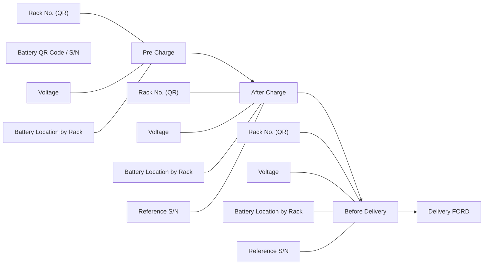

# Battery Workflow Reference

อ้างอิงจากภาพสเก็ตช์ที่ผู้ใช้แนบในแชตเมื่อวันที่ 2026-06-09

## Source Note

ภาพลายมือแบ่ง flow ออกเป็น 3 ช่วงหลัก:

1. `Pre-Charg`
2. `After charg`
3. `Before delivery`

และมีปลายทางสุดท้ายเขียนว่า `Delivery (FORD)`

บางคำในภาพอ่านได้ไม่ชัด 100% โดยเฉพาะ:

- `Pre-Charg` น่าจะหมายถึง `Pre-Charge`
- `After charg` น่าจะหมายถึง `After Charge`
- `Before delivery` ชัดเจนที่สุด
- `Delivery (FORD)` หมายถึงปลายทาง Ford
- `Battery Location` มีโน้ตไทยกำกับว่าอิงตาม `Rack` และ `S/N`

## Interpreted Data Points

### 1. Pre-Charge

เก็บข้อมูล:

- Rack No. `(QR)`
- QR Code
- Battery S/N
- Voltage
- Battery Location by Rack
  - อ้างอิง S/N Battery

### 2. After Charge

เก็บข้อมูล voltage และตำแหน่งการวางบน rack:

- Rack No. `(QR)`
- Voltage
- Battery Location by Rack
  - อ้างอิง S/N

หมายเหตุ:

- ในภาพมีคำว่า `volt`
- มีข้อความคล้าย `Ba` ซึ่งอาจตั้งใจเขียนสั้น ๆ ถึง battery/balance/batch แต่ยังไม่ชัด

### 3. Before Delivery

เก็บข้อมูล voltage และตำแหน่งการวางบน rack:

- Rack No. `(QR)`
- Voltage
- Battery Location by Rack
  - อ้างอิง S/N

จากนั้นไปขั้นตอน:

- Delivery `(FORD)`

## Flow Diagram

## Suggested System Mapping

ถ้าจะแปลงเป็นระบบในโปรเจกต์นี้ต่อ ผมแนะนำ map เป็น 3 operational modes:

1. `PRE_CHARGE`
2. `POST_CHARGE`
3. `BEFORE_DELIVERY`

โดยทุก mode ควรผูกข้อมูลหลักร่วมกัน:

- `rack_qr`
- `battery_sn`
- `voltage`
- `battery_location`
- `captured_at`
- `stage`

## Open Questions

สิ่งที่ควรถามยืนยันจากภาพนี้ก่อนลง schema จริง:

1. `After Charge` ต้องสแกน battery S/N ใหม่ทุกก้อนหรืออ้างจากรอบก่อนหน้า
2. `Battery Location` ต้องเป็นตำแหน่งแบบ `rack/slot` หรือแค่ `rack`.  Ans: Rack/Slot
3. Flow นี้ใช้กับ rack เดิมทั้ง 3 ช่วง หรือมี source/target rack คนละตัว Ans: 3 ช่วง
4. ต้องเก็บภาพทุก stage หรือเก็บเฉพาะบาง stage Ans: หลักๆ คือต้องการรู้จำแหน่งของ Battery ที่วางไว้บน rack
