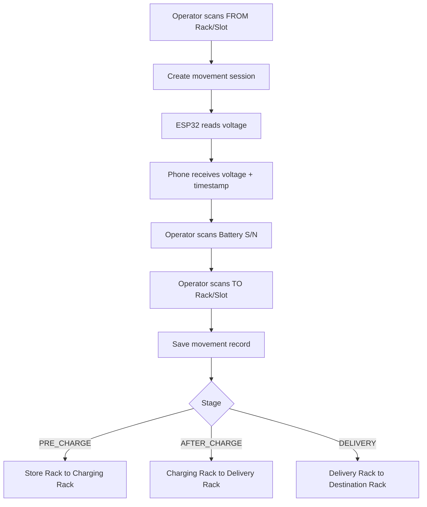

# Hybrid Mobile + ESP32 Workflow

เอกสารนี้สรุป workflow ที่เหมาะกับหน้างานจริง หลังจากพบว่า:

- `Battery S/N` อยู่ด้านข้างแบต จึงอ่านไม่ได้ถ้ายังไม่ยกออกมา
- `Rack / Slot` หน้างานยังไม่มีระบบ marker ที่ชัดพอให้กล้องที่ติด fixed กับตัวยก track เองได้ครบ
- อุปกรณ์ที่ติดกับตัวช่วยยกเหมาะกับการ `วัด voltage` มากกว่าการเป็นตัวอ่านทุกอย่าง

## Recommended Approach

ใช้ระบบแบบ `hybrid`:

1. `มือถือแบบ handheld`
   - ใช้สแกน `Rack / Slot`
   - ใช้สแกน `Battery S/N`
   - ใช้เป็นหน้าจอ workflow ของ operator

2. `ESP32` ที่ติดกับตัวยก
   - ใช้วัด `Voltage`
   - ส่งค่า `Voltage + Timestamp + Device ID` เข้าโทรศัพท์
   - เชื่อมผ่าน `Wi-Fi` หรือ `BLE`

3. `ระบบ backend / local store`
   - รวมข้อมูลจากมือถือและ ESP32 เป็น 1 movement record ต่อการย้ายแบต 1 ก้อน

## Core Idea

ระบบนี้ไม่ใช่ camera tracking แบบอัตโนมัติเต็มรูปแบบ

ระบบนี้คือ `Battery Movement Logging System`

สิ่งที่ต้องรู้ต่อ 1 event:

- ยกออกจาก `Rack / Slot` ไหน
- เป็นแบตก้อนอะไร `Battery S/N`
- วัด `Voltage` ได้เท่าไร
- เอาไปวางที่ `Rack / Slot` ไหน
- เกิดขึ้น `เมื่อไร`

## Stages

มี 3 stage หลัก:

1. `PRE_CHARGE`
2. `AFTER_CHARGE`
3. `DELIVERY`

## Operator Workflow

### 1. PRE_CHARGE

`Store Rack -> Charging Rack`

ลำดับงาน:

1. สแกน `from rack / from slot`
2. เริ่ม session ยกแบตก้อนนี้
3. วัด `Voltage` จาก ESP32 และบันทึกเวลา
4. สแกน `Battery S/N`
5. สแกน `to rack / to slot` ของ Charging Rack
6. บันทึก movement 1 record

### 2. AFTER_CHARGE

`Charging Rack -> Delivery Rack`

ลำดับงาน:

1. สแกน `from rack / from slot`
2. เริ่ม session ยกแบตก้อนนี้
3. วัด `Voltage` จาก ESP32 และบันทึกเวลา
4. สแกน `Battery S/N`
5. สแกน `to rack / to slot` ของ Delivery Rack
6. บันทึก movement 1 record

### 3. DELIVERY

`Delivery Rack -> Destination Rack`

ลำดับงาน:

1. สแกน `from rack / from slot`
2. เริ่ม session ยกแบตก้อนนี้
3. วัด `Voltage` จาก ESP32 และบันทึกเวลา
4. สแกน `Battery S/N`
5. สแกน `to rack / to slot` ของ Rack ปลายทาง
6. บันทึก movement 1 record

## End-to-End Flow Diagram



## UI Flow Recommendation

หน้า operator ควรเปลี่ยนจากแนว `source -> battery -> voltage -> target pallet`
ไปเป็นแนว `from -> voltage -> battery -> to`

ลำดับ UI แนะนำ:

1. `Select Stage`
2. `Scan From Rack/Slot`
3. `Read Voltage`
4. `Scan Battery S/N`
5. `Scan To Rack/Slot`
6. `Save`

สถานะบนหน้าจอควรบอกชัด:

- current stage
- from location
- voltage received or waiting
- battery S/N
- to location
- save complete

## Suggested Rack / Slot Coding

ถ้าหน้างานยังไม่มี ID ชัดเจน ควรกำหนด format ให้แน่นอนก่อน เช่น:

- `STORE-A03-S02`
- `CHG-B01-S05`
- `DLV-C02-S08`
- `FORD-D01-S01`

หรือแยก field:

- `rack_code`
- `slot_code`

## Data Model

ต่อ 1 การย้ายแบต 1 ครั้ง ควรเก็บ:

- `stage`
- `battery_sn`
- `from_rack_code`
- `from_slot_code`
- `to_rack_code`
- `to_slot_code`
- `voltage`
- `voltage_measured_at`
- `moved_at`
- `operator_id`
- `device_id`
- `image_battery_sn`
- `image_from_location`
- `image_to_location`
- `notes`

## Prisma Draft

ด้านล่างคือ draft schema สำหรับคุยต่อก่อน migrate จริง

```prisma
enum MovementStage {
  PRE_CHARGE
  AFTER_CHARGE
  DELIVERY
}

model Battery {
  id          String            @id @default(cuid())
  sn          String            @unique
  label       String?
  chemistry   String?
  nominalVolt Float?
  status      String?
  createdAt   DateTime          @default(now())
  updatedAt   DateTime          @updatedAt

  movements   BatteryMovement[]
}

model RackLocation {
  id         String            @id @default(cuid())
  rackCode   String
  slotCode   String
  zone       String?
  isActive   Boolean           @default(true)
  createdAt  DateTime          @default(now())
  updatedAt  DateTime          @updatedAt

  fromMoves  BatteryMovement[] @relation("MoveFromLocation")
  toMoves    BatteryMovement[] @relation("MoveToLocation")

  @@unique([rackCode, slotCode])
}

model BatteryMovement {
  id                 String         @id @default(cuid())
  stage              MovementStage

  batteryId          String
  battery            Battery        @relation(fields: [batteryId], references: [id])

  fromLocationId     String
  fromLocation       RackLocation   @relation("MoveFromLocation", fields: [fromLocationId], references: [id])

  toLocationId       String
  toLocation         RackLocation   @relation("MoveToLocation", fields: [toLocationId], references: [id])

  voltage            Float?
  voltageMeasuredAt  DateTime?
  movedAt            DateTime       @default(now())

  operatorId         String?
  deviceId           String?
  sessionId          String?

  imageBatterySn     String?
  imageFromLocation  String?
  imageToLocation    String?
  notes              String?

  createdAt          DateTime       @default(now())
  updatedAt          DateTime       @updatedAt

  @@index([stage, movedAt])
  @@index([batteryId, movedAt])
}
```

## API Contract Draft

### 1. Create movement session

`POST /api/movement-sessions`

```json
{
  "stage": "PRE_CHARGE",
  "fromRackCode": "STORE-A03",
  "fromSlotCode": "S02",
  "operatorId": "OP-001",
  "deviceId": "MOBILE-01"
}
```

response:

```json
{
  "sessionId": "sess_123",
  "status": "waiting_voltage"
}
```

### 2. ESP32 sends voltage

`POST /api/esp32/voltage`

```json
{
  "sessionId": "sess_123",
  "deviceId": "ESP32-LIFTER-01",
  "voltage": 12.63,
  "measuredAt": "2026-06-09T14:12:03.000Z"
}
```

### 3. Complete movement

`POST /api/movements`

```json
{
  "sessionId": "sess_123",
  "stage": "PRE_CHARGE",
  "batterySn": "BAT-000123",
  "fromRackCode": "STORE-A03",
  "fromSlotCode": "S02",
  "toRackCode": "CHG-B01",
  "toSlotCode": "S05",
  "voltage": 12.63,
  "voltageMeasuredAt": "2026-06-09T14:12:03.000Z",
  "operatorId": "OP-001",
  "deviceId": "MOBILE-01"
}
```

## Device Integration Options

### Option A: Wi-Fi

ข้อดี:

- ง่ายต่อการส่ง JSON เข้าเว็บ app
- ต่อกับ local network ได้

ข้อเสีย:

- ต้องมี network ที่เสถียร

### Option B: BLE

ข้อดี:

- เหมาะกับอุปกรณ์ที่อยู่ใกล้โทรศัพท์
- ไม่ต้องพึ่ง local Wi-Fi

ข้อเสีย:

- ฝั่ง web app บนมือถือจะมีข้อจำกัด browser มากกว่า

## Recommendation

ถ้าต้องการเริ่มต้นเร็ว:

1. เริ่มด้วย `มือถือ handheld`
2. ให้ `ESP32` ส่งค่าแบบ `Wi-Fi`
3. บันทึกข้อมูลลง local store ก่อน
4. เมื่อ flow ลงตัว ค่อยต่อ backend จริง

## Next Build Steps

ลำดับงานแนะนำในการ implement:

1. เปลี่ยนหน้า `battery-transfer.vue` ให้รองรับ `stage + from + voltage + battery + to`
2. เพิ่ม mock session model ฝั่งหน้าเว็บ
3. เพิ่ม API mock สำหรับรับค่า voltage
4. ปรับ Prisma schema จาก draft นี้
5. เชื่อม ESP32 จริง
